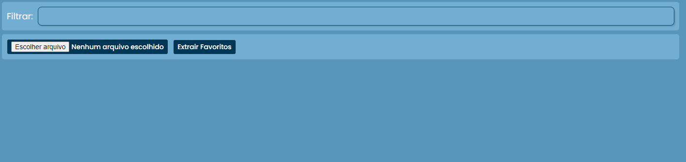

# Bookmark Viewer - Visualizador simples de favoritos no navegador utilizando jframes

Este projeto tem o objetivo de desenvolver uma página simples em HTML, CSS e JavaScript, para carregar e visualizar os favoritos exportados do seu navegador.

Estou desenvolvendo essa solução para visualizar páginas favoritadas mais rapidamente, sem precisar abrir uma nova guia para ver seu conteúdo.

Para usar basta ir até o seu navegador, exportar os seus favoritos para um arquivo, clicar no botão Carregar Arquivo da página do projeto e inserir os seus favoritos, em seguida clique em extrair, assim todos os seus favoritos ficarão visiveis em uma única página, um em cada JFrame.

## Tecnologias

  

## Print Screen

